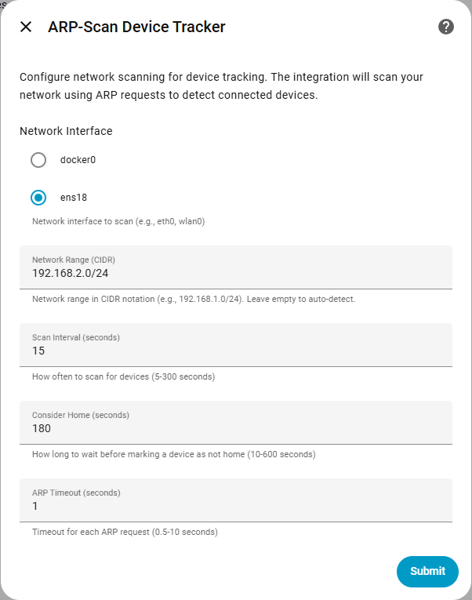
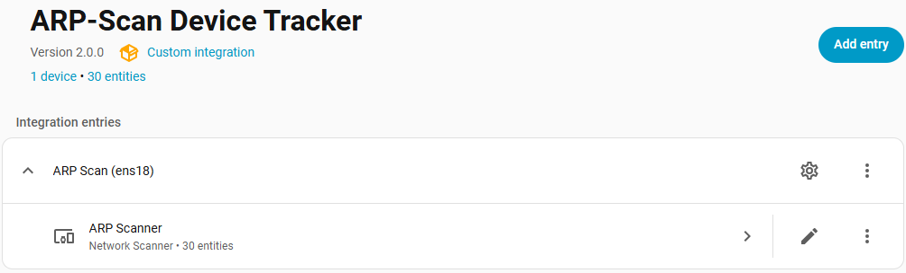
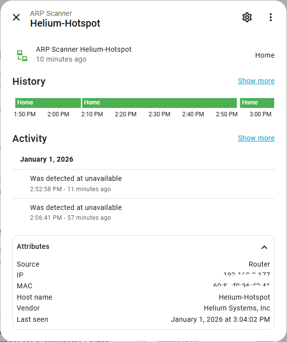

[![GitHub Release][releases-shield]][releases]
[![GitHub Activity][commits-shield]][commits]
[![License][license-shield]](LICENSE)
![Project Maintenance][maintenance-shield]

[](https://www.paypal.me/cyberjunkynl/)
[](https://github.com/sponsors/cyberjunky)

# ARP-Scan Device Tracker Integration

A Home Assistant custom integration that tracks devices on your network using ARP (Address Resolution Protocol) scanning. Which works very fast and is very accurate. This integration uses a pure Python implementation (via scapy) - no external `arp-scan` command required!

## Supported Features

- **Pure Python**: No external dependencies like `arp-scan` command needed
- **GUI Configuration**: Easy setup through Home Assistant's UI (no YAML required)
- **Auto-detection**: Automatically detects network interface and range
- **Vendor Lookup**: Identifies device manufacturers via OUI database
- **Include/Exclude Lists**: Filter devices by IP address
- **Fast Scanning**: Configurable scan intervals and timeouts
- **YAML Migration**: Automatically imports existing YAML configurations

## Entity Attributes

Each tracked device exposes these attributes:

| Attribute | Description |
|-----------|-------------|
| `mac` | MAC address of the device |
| `ip` | Current IP address |
| `vendor` | Device manufacturer (from OUI database) |
| `last_seen` | Timestamp of last detection |

## Screenshots

   

## Installation

### HACS (Recommended)

[](https://my.home-assistant.io/redirect/hacs_repository/?owner=cyberjunky&repository=home-assistant-arpscan_tracker&category=integration)

Alternatively:

1. Ensure [HACS](https://hacs.xyz) is installed
2. Search for "ARPScan" in HACS
3. Click **Download**
4. Restart Home Assistant
5. Add via Settings → Devices & Services
6. Search for "ARP-Scan" and follow the setup wizard

### Manual Installation

1. Copy the `custom_components/arpscan_tracker` folder to your `<config>/custom_components/` directory
2. Restart Home Assistant
3. Add via Settings → Devices & Services

## Configuration

### GUI Setup

1. Go to **Settings → Devices & Services**
2. Click **+ Add Integration**
3. Search for "ARPScan"
4. Select your network interface (auto-detected)
5. Optionally adjust the network range, scan interval, and other settings
6. Click Submit

### Configuration Options

| Option | Default | Description |
|--------|---------|-------------|
| **Network Interface** | Auto-detect | Network interface to scan (e.g., `eth0`, `wlan0`) |
| **Network Range** | Auto-detect | Network in CIDR notation (e.g., `192.168.1.0/24`) |
| **Scan Interval** | 15 seconds | How often to scan for devices (5-300) |
| **Consider Home** | 180 seconds | Time before marking device as not_home (10-600) |
| **ARP Timeout** | 1.0 seconds | Timeout for each ARP request (0.5-10) |
| **Resolve Hostnames** | Enabled | Look up device hostnames via reverse DNS |
| **Include IPs** | Empty | Only track these IP addresses (comma-separated) |
| **Exclude IPs** | Empty | Skip tracking these IP addresses (comma-separated) |

### Device Name Resolution

When **Resolve Hostnames** is enabled, the integration performs reverse DNS lookups to find device hostnames:

- If a hostname is found (e.g., `skull-nuc`), it becomes the entity's display name
- If no hostname is found, the IP address is used as the display name
- Hostnames are cached per scan, so there's minimal performance impact

This is useful for identifying devices by their configured network names rather than just IP addresses.

### Options Flow

After initial setup, you can modify settings via:
1. Go to **Settings → Devices & Services**
2. Find the ARP-Scan integration
3. Click **Configure**

## Migration from YAML

If you have an existing YAML configuration, it will be **automatically imported** on first startup after upgrading to version 2.0.0. You'll see a warning in the logs:

```
YAML configuration for arpscan_tracker is deprecated. Your configuration has been imported. 
Please remove the device_tracker configuration from YAML and restart Home Assistant.
```

After migration:
1. Remove the YAML configuration from `configuration.yaml`
2. Restart Home Assistant
3. Manage settings through the UI

## Permissions

This integration uses raw sockets to send ARP packets. Depending on your installation type:

| Installation | Status |
|--------------|--------|
| **Home Assistant OS** | ✅ Works out of the box |
| **Supervised** | ✅ Works out of the box |
| **Container** | ⚠️ Requires `--cap-add=NET_RAW` |
| **Core** | ⚠️ Requires `CAP_NET_RAW` capability |

### Docker Example

```bash
docker run -d --name homeassistant \
  --cap-add=NET_RAW \
  --network=host \
  -v /path/to/config:/config \
  homeassistant/home-assistant:latest
```

## Troubleshooting

### Common Issues

**No devices found**

1. Verify the correct network interface is selected
2. Check that the network range is correct
3. Ensure Home Assistant has network permissions (see Permissions section)
4. Check logs for permission errors

**Permission denied errors**

If you see "Permission denied for ARP scan" in the logs:
- **Docker**: Add `--cap-add=NET_RAW` to your container
- **Core**: Run with `sudo` or add `CAP_NET_RAW` capability

### Enable Debug Logging

Enable debug logging in `configuration.yaml`:

```yaml
logger:
  default: info
  logs:
    custom_components.arpscan_tracker: debug
```

Alternatively, enable debug logging via the UI in **Settings** → **Devices & Services** → **ARP-Scan** → **Enable debug logging**:


Then perform any steps to reproduce the issue and disable debug logging again. It will download the relevant log file automatically.

## Automation Examples

### Notify When Device Leaves Network

Send a notification when a device has been away for 1 hour:

```yaml
alias: "Device Left Network"
triggers:
  - trigger: state
    entity_id:
      - device_tracker.arpscan_tracker_1c697a658c2  # Replace with your device
    from: home
    to: not_home
    for:
      hours: 0
      minutes: 10
      seconds: 0
conditions: []
actions:
  - action: notify.mobile_app_phone
    data:
      message: "Device {{ trigger.to_state.name }} has left the network"
mode: single
```

### Notify When Device Comes Online

```yaml
alias: "Device Connected"
triggers:
  - trigger: state
    entity_id:
      - device_tracker.arpscan_tracker_1c697a658c2
    from: not_home
    to: home
conditions: []
actions:
  - action: notify.mobile_app_phone
    data:
      message: "{{ trigger.to_state.name }} is back online!"
mode: single
```

### Template Sensor: Convert to Online/Offline

Create a binary sensor that shows `on`/`off` instead of `home`/`not_home`:

```yaml
# configuration.yaml
template:
  - binary_sensor:
      - name: "Server Online"
        unique_id: server_online_status
        device_class: connectivity
        state: "{{ is_state('device_tracker.arpscan_tracker_1c697a658c2', 'home') }}"
        attributes:
          ip: "{{ state_attr('device_tracker.arpscan_tracker_1c697a658c2', 'ip') }}"
          mac: "{{ state_attr('device_tracker.arpscan_tracker_1c697a658c2', 'mac') }}"
          last_seen: "{{ state_attr('device_tracker.arpscan_tracker_1c697a658c2', 'last_seen') }}"
```

This creates a `binary_sensor.server_online` entity with:
- State: `on` (Connected) / `off` (Disconnected)
- Device class `connectivity` for proper UI icons

### Turn Off Lights When Everyone Leaves

```yaml
alias: "Everyone Left - Lights Off"
triggers:
  - trigger: state
    entity_id:
      - device_tracker.arpscan_tracker_phone1
      - device_tracker.arpscan_tracker_phone2
    to: not_home
    for:
      minutes: 10
conditions:
  - condition: state
    entity_id: device_tracker.arpscan_tracker_phone1
    state: not_home
  - condition: state
    entity_id: device_tracker.arpscan_tracker_phone2
    state: not_home
actions:
  - action: light.turn_off
    target:
      entity_id: light.living_room
mode: single
```


## Development

Quick-start (from project root):

```bash
python3 -m venv .venv
source .venv/bin/activate
python -m pip install --upgrade pip
pip install -r requirements_lint.txt
./scripts/lint    # runs pre-commit + vulture
# or: ruff check .
# to auto-fix: ruff check . --fix
```

## 💖 Support This Project

If you find this library useful for your projects, please consider supporting its continued development and maintenance:

### 🌟 Ways to Support

- **⭐ Star this repository** - Help others discover the project
- **💰 Financial Support** - Contribute to development and hosting costs
- **🐛 Report Issues** - Help improve stability and compatibility
- **📖 Spread the Word** - Share with other developers

### 💳 Financial Support Options

[](https://www.paypal.me/cyberjunkynl/)
[](https://github.com/sponsors/cyberjunky)

**Why Support?**

- Keeps the project actively maintained
- Enables faster bug fixes and new features
- Supports infrastructure costs (testing, AI, CI/CD)
- Shows appreciation for hundreds of hours of development

Every contribution, no matter the size, makes a difference and is greatly appreciated! 🙏

## License

This project is licensed under the MIT License - see the [LICENSE](LICENSE) file for details.

---

[releases-shield]: https://img.shields.io/github/release/cyberjunky/home-assistant-arpscan_tracker.svg?style=for-the-badge
[releases]: https://github.com/cyberjunky/home-assistant-arpscan_tracker/releases
[commits-shield]: https://img.shields.io/github/commit-activity/y/cyberjunky/home-assistant-arpscan_tracker.svg?style=for-the-badge
[commits]: https://github.com/cyberjunky/home-assistant-arpscan_tracker/commits/main
[license-shield]: https://img.shields.io/github/license/cyberjunky/home-assistant-arpscan_tracker.svg?style=for-the-badge
[maintenance-shield]: https://img.shields.io/badge/maintainer-cyberjunky-blue.svg?style=for-the-badge
